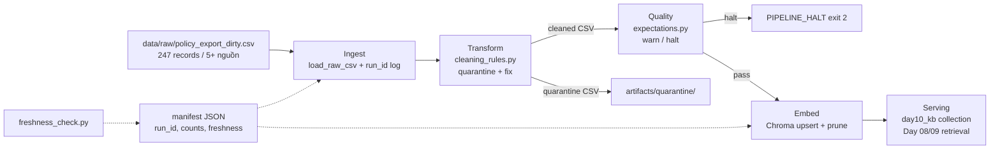

# Kiến trúc pipeline — Lab Day 10

**Nhóm:** Nhóm CS-IT Data Pipeline  
**Cập nhật:** 2026-06-10

---

## 1. Sơ đồ luồng

**Điểm đo freshness:** sau bước publish embed (`manifest.latest_exported_at`, `run_timestamp`).  
**run_id:** ghi trong `artifacts/logs/run_<run-id>.log`, manifest, metadata Chroma.

---

## 2. Ranh giới trách nhiệm

| Thành phần | Input | Output | Owner nhóm |
|------------|-------|--------|------------|
| Ingest | `policy_export_dirty.csv` | `raw_records` log | Ingestion Owner |
| Transform | raw rows | `cleaned_*.csv`, `quarantine_*.csv` | Cleaning / Quality Owner |
| Quality | cleaned rows | expectation OK/FAIL, halt | Cleaning / Quality Owner |
| Embed | cleaned CSV | Chroma `day10_kb`, `embed_upsert` log | Embed Owner |
| Monitor | manifest JSON | PASS/WARN/FAIL freshness | Monitoring / Docs Owner |

---

## 3. Idempotency & rerun

- **Key ổn định:** `chunk_id = sha256(doc_id|text|seq)[:16]` — không đổi khi rerun cùng dữ liệu cleaned.
- **Upsert:** `col.upsert(ids=chunk_id, …)` — rerun không nhân đôi vector.
- **Prune:** xóa id có trong collection nhưng không còn trong cleaned run hiện tại (`embed_prune_removed` trong log).
- **Kiểm chứng:** chạy `python etl_pipeline.py run --run-id day10-final` hai lần → `embed_upsert count` giữ nguyên (34), không tăng.

---

## 4. Liên hệ Day 09

Pipeline Day 10 xử lý **export bẩn** (`data/raw/`) và embed vào collection `day10_kb` (tách khỏi Day 09). Cùng domain artifact (`data/docs/`: refund, SLA, FAQ, HR, access control) nên retrieval worker Day 09 có thể trỏ `CHROMA_COLLECTION=day10_kb` sau khi pipeline pass để agent đọc đúng version đã clean.

---

## 5. Rủi ro đã biết

- Dữ liệu mẫu có `exported_at` tháng 4/2026 → `freshness_check=FAIL` với SLA 24h (cố ý — ghi trong runbook).
- Embedding model `all-MiniLM-L6-v2` có thể rank sai chunk hiếm (vd escalation P1) nếu thiếu rule enrich topic prefix.
